# OpenVolleyScout

<p align="center">
  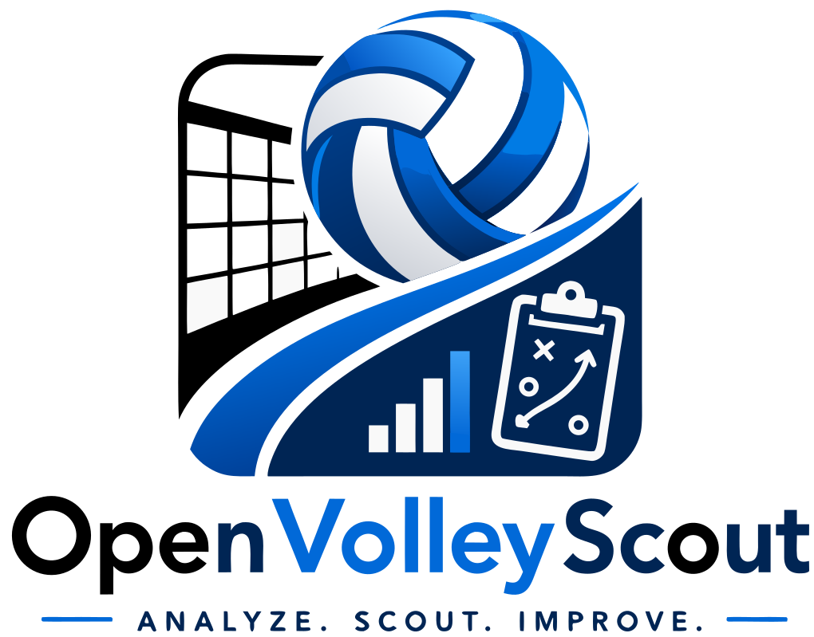
</p>

<p align="center">
  <b>Analyze. Scout. Improve.</b>
</p>

<p align="center">
  
  
  
  
</p>

OpenVolleyScout is a local-first volleyball scouting and analysis application
for match setup, live rally recording, DataVolley import/export,
tactical-system editing, video review, team data study, and match reporting.

The application runs in the browser and can also be packaged as a desktop app
with Tauri. Match projects, team archives, rosters, competition names, and
video-analysis metadata are persisted on the device with IndexedDB. Locale and
tactical-system editor state are stored in `localStorage`.

Live demo: https://napo.github.io/openvolleyscout

> The project is under active development. Some workflows are complete enough
> to use as foundations, while analysis and advanced tactical automation are
> still evolving.

## Installation & Downloads

### Desktop Application

Download packaged builds from the
[latest GitHub release](https://github.com/napo/openvolleyscout/releases/latest).
Available artifacts can vary by release and platform.

### Web Browser (No Installation)

No installation needed — use the [live demo](https://napo.github.io/openvolleyscout) directly in any modern browser.

See all [releases](https://github.com/napo/openvolleyscout/releases) for older versions.

## Current Capabilities

- Create and manage archived teams and rosters.
- Import and export rosters in JSON/CSV formats.
- Create match projects from competition metadata, selected teams, and
  match-specific rosters.
- Configure match-level scouting settings such as set targets and tie-break
  targets.
- Start sets from selected lineups and serving team.
- Record rally events, touches, points, substitutions, timeouts, score
  corrections, undo, set endings, and match endings through an event log.
- Persist scouting progress back into the active `MatchProject`.
- Generate live quick stats, set summaries, rally summaries, and DataVolley-like
  rally strings from recorded events.
- Import DataVolley `.dvw` files with preview, diagnostics, duplicate handling,
  team archive merge, and validation (non-blocking import warnings can be
  hidden from a Settings toggle; blocking errors always stop the import).
- Export OpenVolleyScout matches back to DataVolley-compatible `.dvw` files.
- Build match reports with printable, PNG, and PDF export.
- Explore team and player dashboards with filters, evaluation distributions,
  efficiency, points/errors, side-out study, heatmaps, and radar comparison
  charts.
- Link local or YouTube videos to matches, synchronize actions, filter clips,
  edit action codes, and export selected clips where supported.
- Watch a local file, YouTube, webcam, or RTSP video in a floating panel
  while scouting live, with touches recording their video position
  automatically.
- Switch the live scouting court between landscape and portrait orientation,
  with an in-toolbar rotate button and a team-swap button usable at any
  point during a rally.
- Aggregate saved matches for team-level study, cross-database similarity
  comparison, and multi-match video analysis.
- Review a "Priorities" view under Trends that ranks a team's or player's
  technical and tactical-rotation indicators against their own benchmark
  (their wins within the selected match window), with radar/bar charts and
  a per-category drill-down of evaluation mix over time.
- Edit and persist reception and defense system libraries in the browser.
- Use the app in multiple UI languages.

## Technical Stack

- React 18
- TypeScript
- Vite
- Tauri 2
- React Router
- Zustand
- Dexie / IndexedDB
- Recharts
- simpleheat
- pdfmake

## Local Development

Install dependencies:

```bash
npm install
```

Start the development server:

```bash
npm run dev
```

Build for production:

```bash
npm run build
```

Preview a production build:

```bash
npm run preview
```

Run the current validation script:

```bash
npm test
```

`npm test` currently runs match-stat validation, live scouting flow validation,
DataVolley export validation, and the unit test suite.

## Main Application Routes

The app uses hash routing, so routes are rendered under `#/...`.

- `#/` - landing page
- `#/teams` - archived team and roster management
- `#/team-analysis` - multi-match team data study
- `#/match` - match setup workflow
- `#/scouting` - live scouting workflow
- `#/systems` - reception and defense system editors
- `#/analysis` - match report, dashboards, DataVolley export, and video analysis
- `#/load-data` - saved match project loading
- `#/settings` - locale and local-data actions
- `#/about` - project information

## Documentation

Start with [docs/README.md](docs/README.md).

Important entry points:

- [User Guide](docs/user-guide.md)
- [Architecture](docs/architecture.md)
- [Data Model](docs/data-model.md)
- [Domain Model](docs/domain-model.md)
- [Persistence](docs/persistence.md)
- [Scouting Architecture](docs/scouting.md)
- [Tactical Systems](docs/systems.md)
- [Code Structure](docs/code-structure.md)
- [Developer Guidelines](docs/developer-guidelines.md)

## Project Status

Implemented foundations:

- local match and archive persistence
- match creation and readiness validation
- event-sourced scouting session replay
- scouting persistence into `MatchProject.events` and `MatchProject.scoutingSession`
- DataVolley import and export
- match statistics builder and validation fixtures
- match report generation with print, PNG, and PDF export
- performance dashboards, side-out study, heatmaps, and team aggregation
- video analysis with synchronization and clip workflows
- reception and defense system editors backed by `localStorage`
- multilingual UI with persisted locale choice

Still in progress:

- broader DataVolley compatibility for edge cases
- advanced player suggestion from tactical systems
- persistent tactical-system repository in IndexedDB
- deeper team/system association workflows
- broader automated test coverage

## Preview

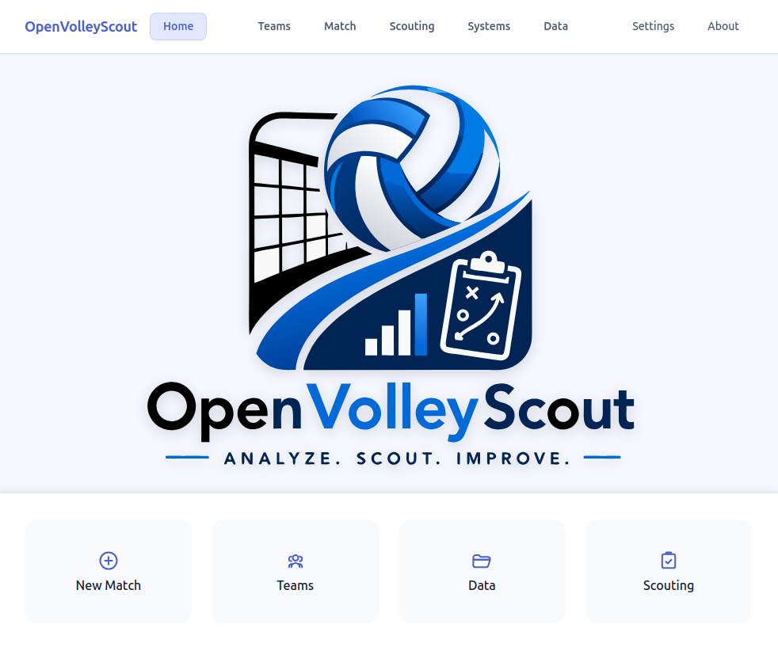  
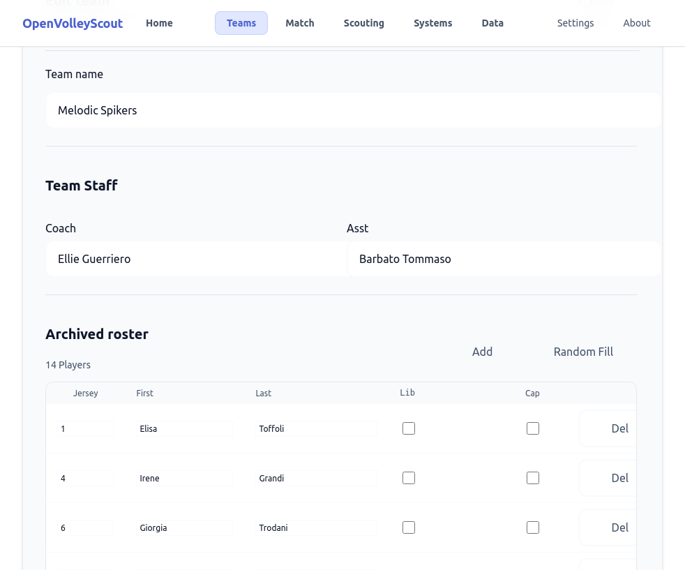  
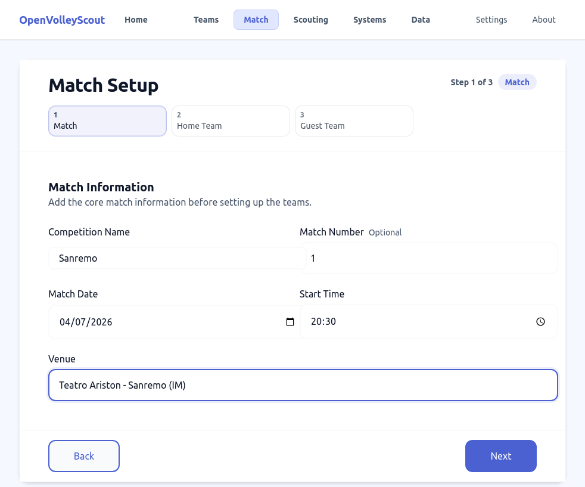  
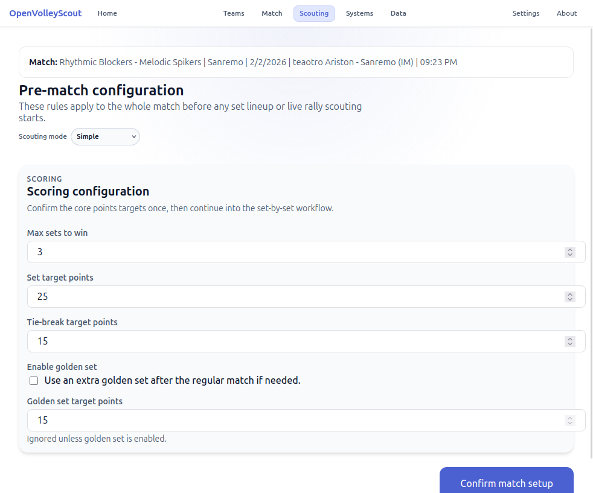  
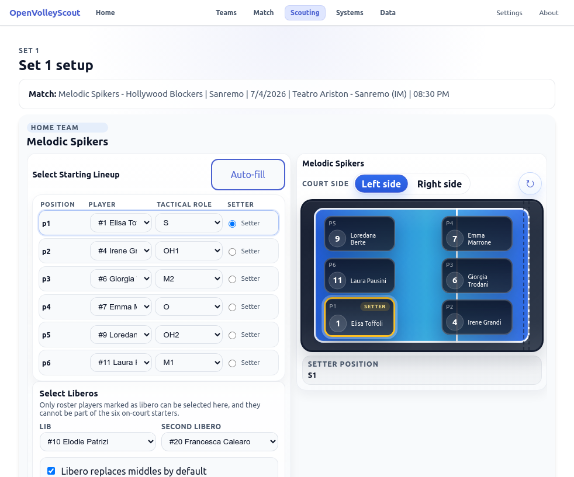  
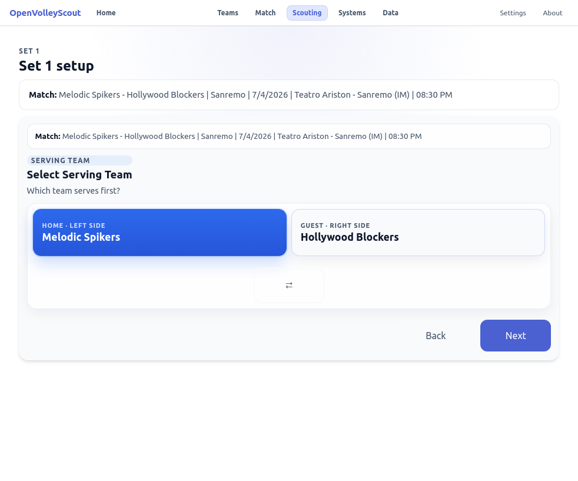  
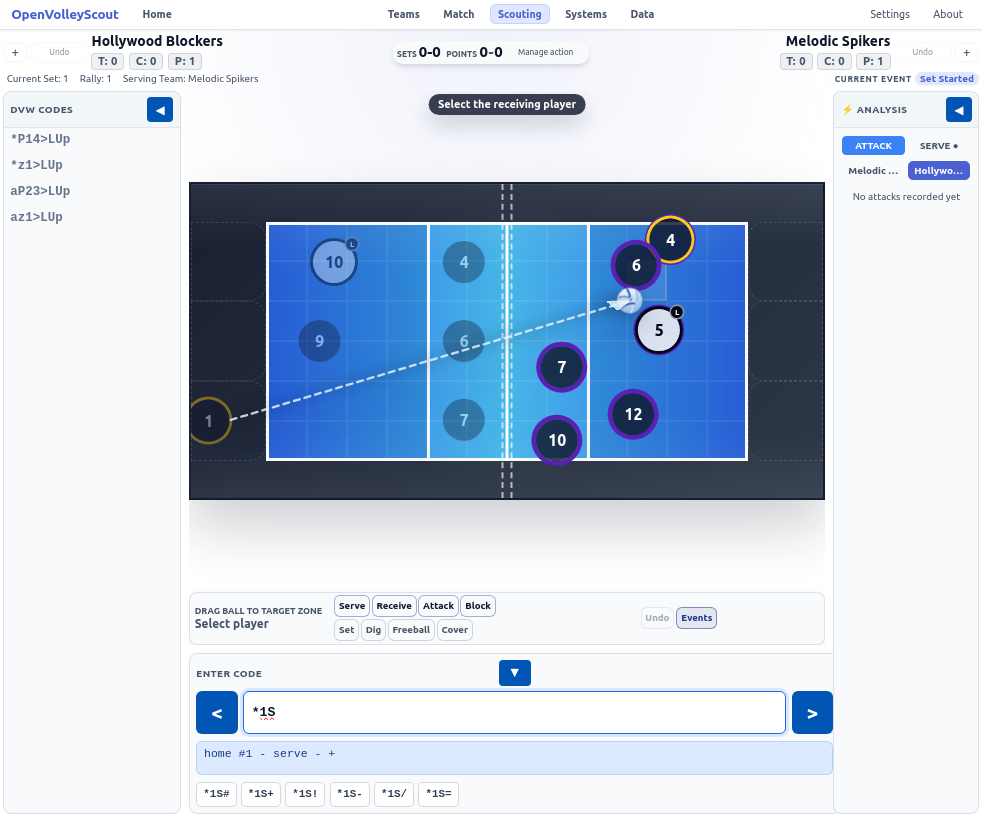  
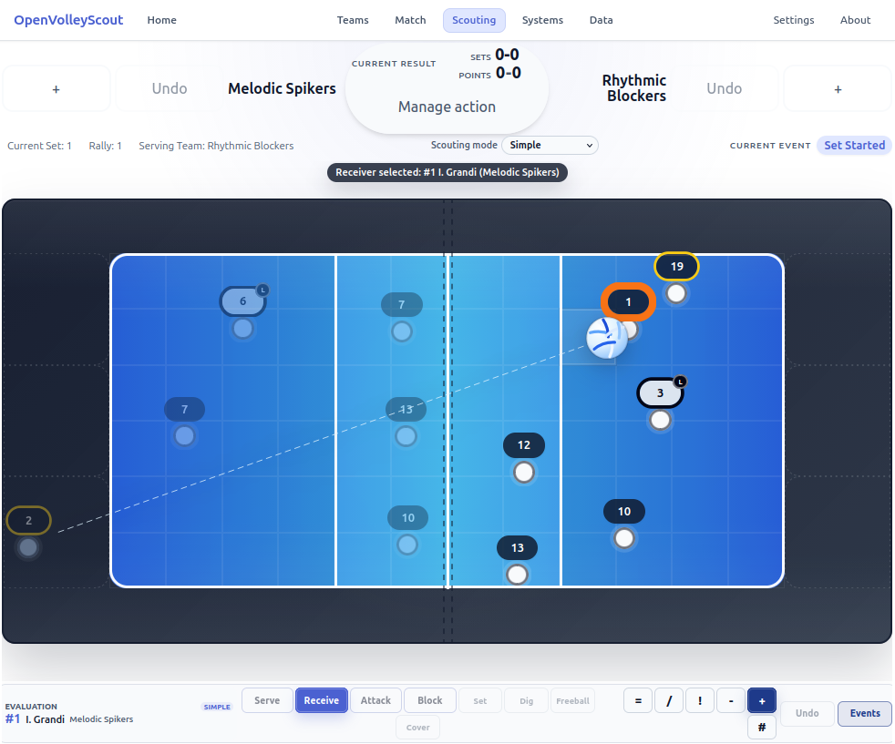  
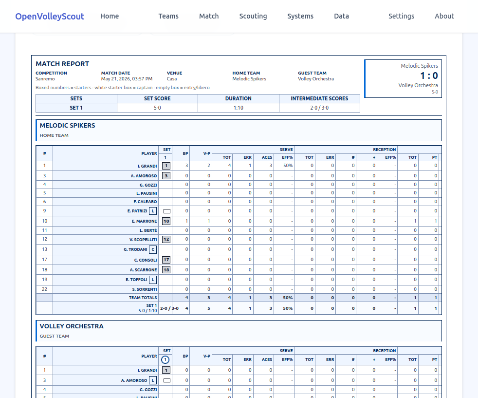  
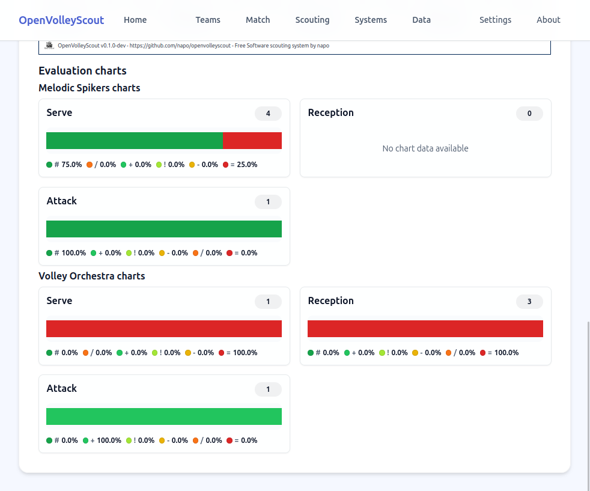  
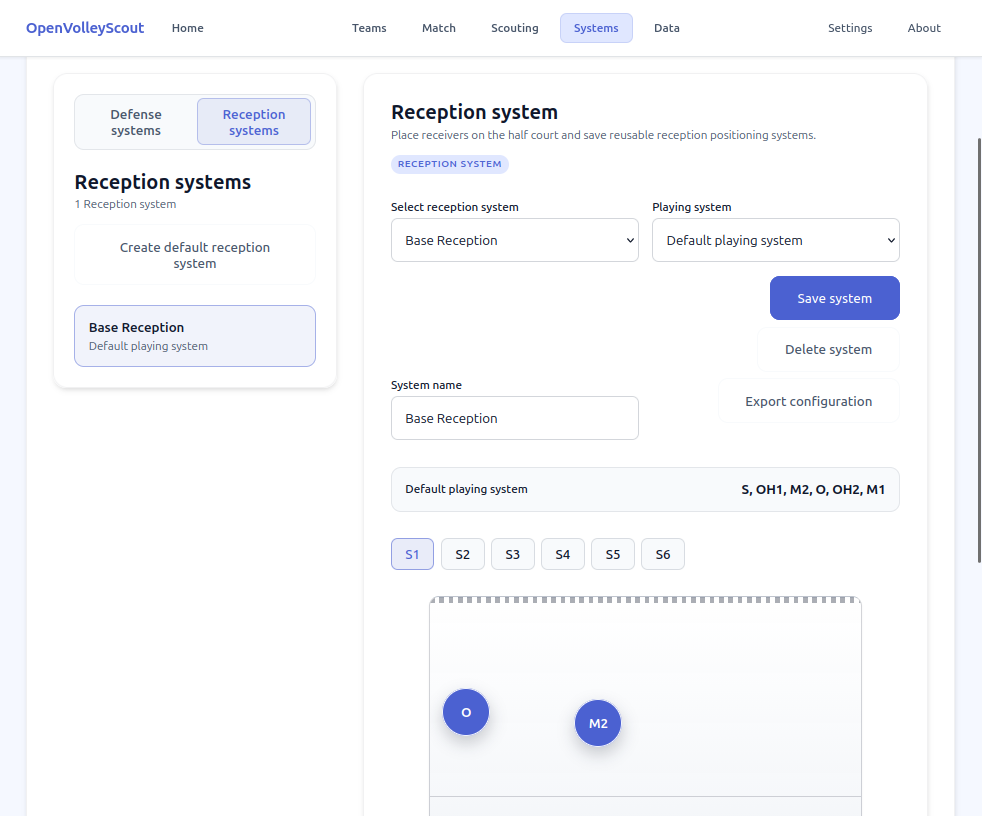
