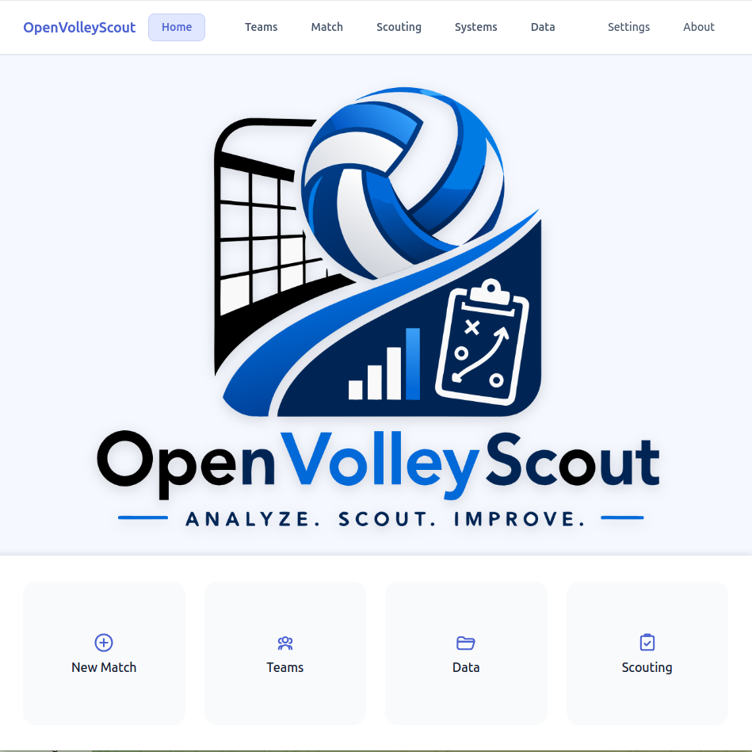

# OpenVolleyScout

<p align="center">
  
</p>

<p align="center">
  <b>Analyze. Scout. Improve.</b>
</p>

<p align="center">
  
  
  
  
</p>

---

## 🌐 Live Demo

👉 https://napo.github.io/openvolleyscout

> ⚠️ The application is under active development. Expect changes and incomplete features.

---

## 🏐 What is OpenVolleyScout?

OpenVolleyScout is a **web-based volleyball scouting tool** designed to make match data collection:

- simple
- fast
- accessible
- installation-free

It runs directly in the browser and is optimized for **touch interaction on portable devices**.

---

## 🎯 Vision

OpenVolleyScout aims to provide a modern alternative for volleyball data collection by combining:

- intuitive interaction
- real-time feedback
- structured data capture
- future compatibility with DataVolley workflows

The long-term goal is to bridge **ease of use** and **professional scouting depth**.

---

## ⚙️ Key Principles

### 🧩 No Installation
- runs entirely in your browser
- no setup required

### 💾 Local-first
- data stays on your device
- no server dependency
- full control over your data

### ✋ Touch-first Interaction
- designed to follow the ball with your finger
- natural and fast input method

### 📱 Portable Use
- works on different devices
- **tablet recommended** for best experience

---

## 🎮 How it works

The scouting workflow is being designed around:

- tracking the ball movement on the court
- selecting actions through direct interaction
- receiving contextual suggestions (player, skill, evaluation)

⚠️ The full interaction model is still evolving.

---

## 🔄 Current Status

The project currently includes:

- match setup workflow
- team and roster management
- initial scouting session structure
- event-based data model
- basic rally lifecycle
- GitHub Pages deployment

Still in progress:

- full court interaction (ball tracking)
- advanced scouting logic
- rotation and role automation
- complete DataVolley-style encoding

---

## 📸 Preview

*(Add screenshots here)*

```markdown


